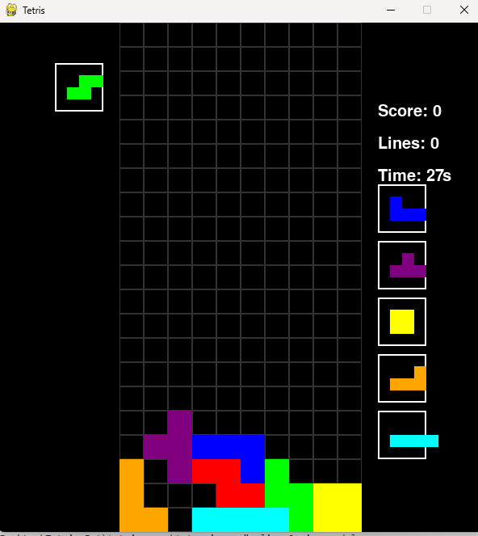

# Tetris Bot

An AI-powered Tetris bot with optimized decision-making via alpha-beta pruning and bitboard encoding.

## Project Structure

- `main.py`: Launches the Tetris game for manual play.
- `bot/tetris_bot.py`: Core bot file where AI logic for playing the game autonomously is implemented.
- `tetris_game/`: Game logic, piece movement, and scoring.
- `bot/`: AI logic with move generation (`get_possible_moves.py`), control handling (`controls.py`), and scoring (`score.py`).

## Wow

